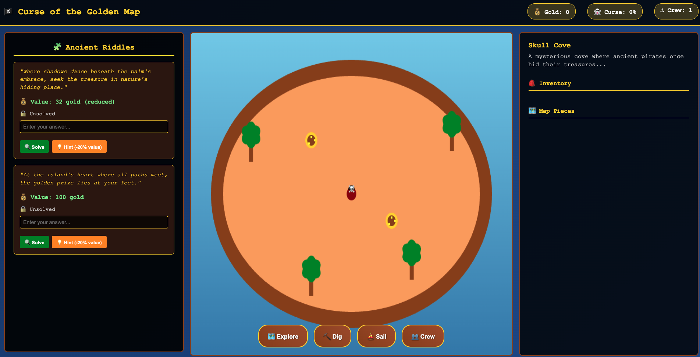

# 🏴‍☠️ Curse of the Golden Map

An engaging pirate adventure game that works on both web and mobile platforms. Explore mysterious islands, solve ancient riddles, hunt for treasure, and manage your pirate crew while avoiding the growing curse!

## 🎮 Game Preview

## 🎮 Game Features

- **Island Exploration**: Navigate through 3 unique islands with distinct themes
- **Riddle System**: Solve ancient puzzles to unlock treasures
- **Crew Management**: Recruit specialized crew members with unique abilities
- **Curse Mechanics**: Balance treasure hunting with growing supernatural threats
- **Mobile Friendly**: Touch controls and responsive design
- **Progressive Gameplay**: Collect map pieces to find the legendary Heart of Gold

## 🚀 How to Play

1. Open `index.html` in any modern web browser
2. Click/tap to move your pirate around the island
3. Use the riddles panel on the left to solve puzzles
4. Explore areas to find items and clues
5. Dig for treasure once riddles are solved
6. Recruit crew members to help with your journey
7. Sail between islands to find all treasures
8. Collect map pieces to unlock the final treasure

## 🏝️ Islands

1. **Skull Cove** - Mysterious starting island with hidden treasures
2. **Siren's Rest** - Enchanted mermaid territory with magical rewards  
3. **Devil's Triangle** - Cursed final challenge with the greatest treasures

## 🧩 Riddle System

- Each treasure is protected by an ancient riddle
- Solve riddles to unlock treasure digging
- Use hints (reduces treasure value by 20%)
- Maximum 2 hints per riddle

## 👥 Crew Members

- **Navigator Luna** - Improves map reading abilities
- **Gunner Jack** - Provides combat assistance
- **Cook Martha** - Boosts crew morale
- **Ghost Whisperer Sage** - Reduces curse effects

## 🎯 Victory Conditions

Collect enough map pieces and find the legendary Heart of Gold while managing your curse level and crew loyalty!

## 🛠️ Technologies Used

- HTML5 Canvas for game rendering
- Vanilla JavaScript for game logic
- CSS3 for responsive design and animations
- Mobile-first responsive design

## 📱 Mobile Support

The game automatically adapts to mobile devices with:
- Touch controls for movement
- Responsive UI layout
- Optimized button sizes
- Portrait and landscape support

---

*Ahoy, Captain! Your adventure awaits!* 🏴‍☠️